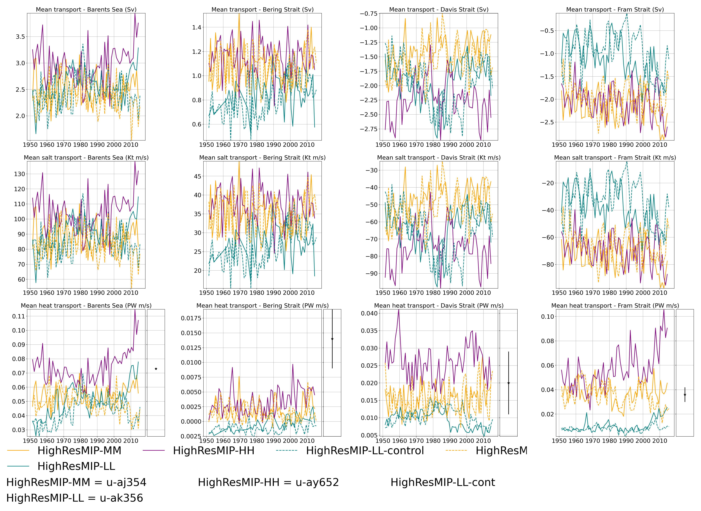
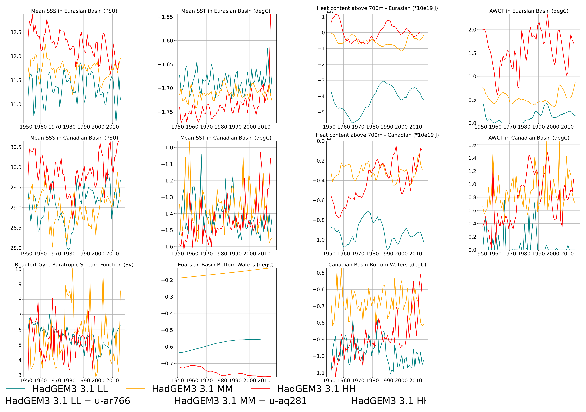

# VALARC

## Table of Contents
1. [Introduction](#introduction)
2. [Getting Started](#getting_started)
3. [How to run](#howtorun)
4. [Output](#output)
5. [Authors](#authors)
6. [Licence](#licence)
7. [Acknowledgements](#acknowledgement)

<a name="introduction"></a>
## Introduction

A software package for ocean scientists to calculate and plot the following evaluation metrics to compare Arctic Ocean biases between CMIP models
  with a NEMO ocean:

   * Bottom Water Temperature (degC)
   * Freshwater content
   * Beaufort Gyre Stream Function (Sv)
   * Heat content (J)
   * Mixed layer depth
   * Sea surface salinity in EB and CB (PSU)
   * Sea surface temperature in EB and CB (degC)
   * Fram Strait transport (PW)
   * Davis Strait transport (PW)
   * Bering Strait tranport (PW)
   * Barents Sea transport (PW)
   * Temperature profile in EB and CB (degC)
   * Salinity profile in EB and CB (PSU)


<a name="getting_started"></a>
## Getting Started

* Creating and activating the Conda environment. 

```
   cd VALARC_v1.0

   conda env create -f valarc.yml
   
   conda activate valarc
   
```

* Download CDFTOOLs_4.0 toolbox and compile it using the instructions in the CDFTOOLS repository (or use the version in the repository).
* Note, CDFTools_4.0 is now available within the VALARC_v1.0 repository when cloned

```
   git clone https://github.com/meom-group/CDFTOOLS

```

* Edit `param.bash` to fit your setup/need
   * mesh mask location with mesh mask name
   * location of the CDFTOOLS toolbox
   * where to store the data output (or link to existing data location)
    
<a name="howtorun"></a>
## How to run
 * To retrieve the data from MASS and calculate the metrics using CDFtools and Python (metrics to calculate are 
   specified in `param.bash`, otherwise all are calculated) :
  
```
./run_all.bash [CONFIG] [YEARB] [YEARE] [FREQ] [RUNID list]
```
For example:
```
./run_all.bash eORCA025 1980 1990 1y u-ai599 u-co779
```

Note the `CONFIG` is used for the mesh_mask file and is either `ORCA1`, `ORCA025` or `ORCA12`.
Define the line colour and linestyle for each simulation `style_6_initial.db`.
Instead of annual averages, to select monthly averages, set `FREQ` to `1m`.

 * To plot the time series of the VALARC metrics:
```
./run_plot_VALARC.bash [KEY] [FREQ] [RUNID list]
```
For example:
```
./run_plot_VALARC.bash ORCA1 1y u-ai599 u-co779
```


<a name="output"></a>
## Output
 * All individual time series are saved in the FIGURES directory with txt file describing the specific command line to 
   build it.
 * The single figure with all the metrics, and a map of the locations used for averaging, is outputted in the main 
   directory. The observed mean and 1 standard deviation is displayed via the error bar (outside 2 standard deviations 
   is highlighted in red). An example for Transports is shown below:



A repeat for the T/S metrics only is shown below:



<a name="authors"></a>
## Authors
* [roberts-luke](https://github.com/roberts-luke)

<a name="licence"></a>
## Licence

[comment]: <> ([![License: MIT]&#40;https://img.shields.io/badge/License-MIT-yellow.svg&#41;]&#40;https://opensource.org/licenses/MIT&#41;)

<a name="acknowledgement"></a>
## Acknowledgements
* Based on VALSO (Southern Ocean evaluation metrics) by Pierre Mathiot and VALNA (North Atlantic validation tool) by Sophia Moreton
